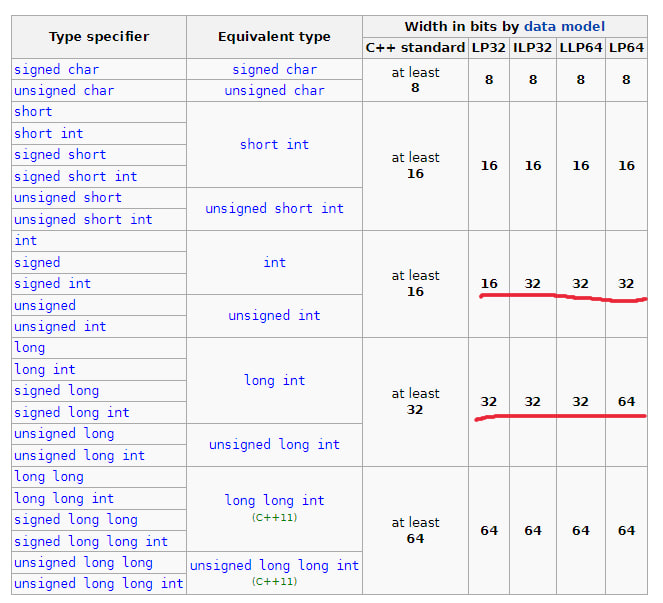

All integer types has different sizes, but I think it has one dumb think

(Source)[https://en.cppreference.com/w/cpp/language/types]

Depended on data model (32/64 bit systems and Windows/Unix platform), I can't for all 
models guarantee number type, that will be have 32 bits everywhere

What I can see
- Win16 API broken here everything, this is only thing, that have int = 16 bits
- If I will never used it, I can without problems can have
    - `short` as 16 bit number
    - `int` as 32 bit number
    - `long long` as 64 bit number
