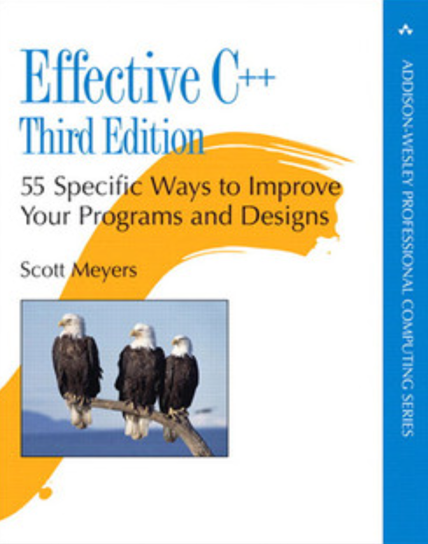

## Effective C++

Universal tips for C++ developer. Even after decades, this book still has relevant information about most topics

Useful links
- [Short declaration of the book](https://gist.github.com/asambol/fa234c747ba4a677dee7b2ddaa64778d)
